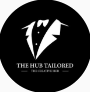

# The Creative Hub UG - Premium Men's Wear Website

A modern, responsive website for The Creative Hub UG, showcasing premium men's wear and custom tailoring services. Built with Next.js 13, React, and Tailwind CSS.



## Features

- 🎨 Modern, responsive design
- 📱 Mobile-first approach
- 🖼️ Interactive image gallery with descriptions
- 📝 Contact form with location integration
- 🎯 Custom tailoring services showcase
- 🔍 Category-based filtering
- ⚡ Fast loading with Next.js 13
- 💅 Styled with Tailwind CSS

## Pages

1. **Home Page**
   - Hero section with call-to-action
   - Featured services
   - Latest designs showcase

2. **About Page**
   - Company story
   - Team members
   - Core values
   - Experience highlights

3. **Gallery**
   - Interactive image grid
   - Detailed design descriptions
   - Category filtering
   - Full-screen image view

4. **Contact**
   - Contact form
   - Google Maps integration
   - Social media links
   - Business hours

## Tech Stack

- **Framework**: Next.js 13
- **Language**: TypeScript
- **Styling**: Tailwind CSS
- **UI Components**: Headless UI
- **Icons**: React Icons
- **Animations**: CSS Transitions

## Getting Started

1. **Clone the repository**
   ```bash
   git clone https://github.com/ClaireAgaba/Creative-Hub.git
   cd Creative-Hub/mens-wear-website
   ```

2. **Install dependencies**
   ```bash
   npm install
   # or
   yarn install
   ```

3. **Run the development server**
   ```bash
   npm run dev
   # or
   yarn dev
   ```

4. **Open your browser**
   Navigate to [http://localhost:3000](http://localhost:3000)

## Project Structure

```
mens-wear-website/
├── public/
│   └── images/         # Static images
├── src/
│   ├── app/           # Next.js 13 app directory
│   │   ├── about/     # About page
│   │   ├── contact/   # Contact page
│   │   ├── gallery/   # Gallery page
│   │   └── page.tsx   # Home page
│   └── components/    # Reusable components
└── ...config files
```

## Key Components

- `Navbar`: Responsive navigation with mobile menu
- `HeroSection`: Dynamic hero section with background image
- `Gallery`: Interactive image gallery with modal view
- `ContactForm`: Form component with validation
- `ImageModal`: Full-screen image viewer
- `Footer`: Site-wide footer with contact info

## Deployment

The site is configured for easy deployment on Vercel:

1. Push your changes to GitHub
2. Connect your repository to Vercel
3. Vercel will automatically build and deploy your site

## Contact

For inquiries about custom tailoring and men's wear:
- **Location**: Luwum Street, California Plaza Kampala, Uganda
- **Phone**: +256 703 198 158 | +256 779 145 601
- **Social Media**: Follow us on [Facebook](https://facebook.com/creativehubug) and [Instagram](https://instagram.com/creativehubug)

## Contributing

1. Fork the repository
2. Create your feature branch (`git checkout -b feature/AmazingFeature`)
3. Commit your changes (`git commit -m 'Add some AmazingFeature'`)
4. Push to the branch (`git push origin feature/AmazingFeature`)
5. Open a Pull Request

## License

This project is licensed under the MIT License - see the LICENSE file for details.

---
Built with ❤️ by [Claire Agaba](https://github.com/ClaireAgaba)
